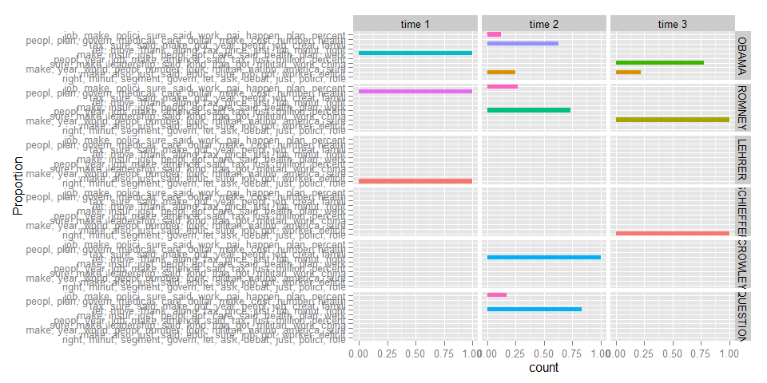

gofastr   
============

**gofastr** is designed to do one thing really well...make a
`DocumentTermMatrix`. It harnesses the power
[**quanteda**](https://github.com/kbenoit/quanteda) (which in turn wraps
**data.table**, **stringi**, & **Matrix**) to quickly generate **tm**
`DocumentTermMatrix` and `TermDocumentMatrix` data structures. There are
two ways in which time is meaingingful to an analyst: (a) coding time,
or the time spent writing code and (b) computational run time, or the
time the computer takes to run the code. Ideally, we want to minimize
both of these sources of time expenditures. The **gofaster** package is
my attempt to reduce the time an analysts takes to turn raw text into an
analysis ready data format and relies on **quanteda** to minimize the
run time.

In my work I often get data in the form of large .csv files or SQL
databases. Additionally, most of the higher level analysis of text I
undertake utilizes a `TermDocumentMatrix` or `DocumentTermMatrix` as the
input data. Generally, the **tm** package's `Corpus` structure is an
unnecessary step in building a usable data structure that requires
additional coding and run time. **gofastr** skips this step and uses
[**quanteda**](https://github.com/kbenoit/quanteda) to quickly make the
`DocumentTermMatrix` or `TermDocumentMatrix` structures that are fast to
code up and fast for the computer to build.

Table of Contents
============

-   [Function Usage](#function-usage)
-   [Installation](#installation)
-   [Contact](#contact)
-   [Demonstration](#demonstration)
    -   [Load Packages](#load-packages)
    -   [DocumentTerm/TermDocument Matrices](#documenttermtermdocument-matrices)
    -   [Stopwords](#stopwords)
    -   [Weighting](#weighting)
    -   [Stemming](#stemming)
    -   [Manipulating via Words](#manipulating-via-words)
        -   [Filter Out Low Occurring Words](#filter-out-low-occurring-words)
        -   [Filter Out High/Low Frequency (low information) Words](c("low-information"-"#filter-out-highlow-frequency-low-information-words"))
    -   [Manipulating via Documents](#manipulating-via-documents)
        -   [Filter Out Low Occurring Documents](#filter-out-low-occurring-documents)
        -   [Selecting Documents](#selecting-documents)
    -   [Putting It Together](#putting-it-together)
        -   [LDAvis of Model](#ldavis-of-model)
    -   [Comparing Timings](#comparing-timings)
        -   [With Stemming](#with-stemming)

Function Usage
============

Functions typically fall into the task category of matrix (1) *creation*
& (2) *manipulating*. The main functions, task category, & descriptions
are summarized in the table below:

<table>
<colgroup>
<col width="22%" />
<col width="13%" />
<col width="64%" />
</colgroup>
<thead>
<tr class="header">
<th>Function</th>
<th>Category</th>
<th>Description</th>
</tr>
</thead>
<tbody>
<tr class="odd">
<td><code>q_tdm</code> &amp; <code>q_tdm_stem</code></td>
<td>creation</td>
<td><code>TermDocumentMatrix</code> from string vector</td>
</tr>
<tr class="even">
<td><code>q_dtm</code> &amp; <code>q_dtm_stem</code></td>
<td>creation</td>
<td><code>DocumentTermMatrix</code> from string vector</td>
</tr>
<tr class="odd">
<td><code>remove_stopwords</code></td>
<td>manipulation</td>
<td>Remove stopwords and minimal character words from <code>TermDocumentMatrix</code>/<code>DocumentTermMatrix</code></td>
</tr>
<tr class="even">
<td><code>filter_words</code></td>
<td>manipulation</td>
<td>Filter words from <code>TermDocumentMatrix</code>/<code>DocumentTermMatrix</code></td>
</tr>
<tr class="odd">
<td><code>filter_tf_idf</code></td>
<td>manipulation</td>
<td>Filter low tf-idf words from <code>TermDocumentMatrix</code>/<code>DocumentTermMatrix</code></td>
</tr>
<tr class="even">
<td><code>filter_documents</code></td>
<td>manipulation</td>
<td>Filter documents from a <code>TermDocumentMatrix</code>/<code>DocumentTermMatrix</code></td>
</tr>
<tr class="odd">
<td><code>select_documents</code></td>
<td>manipulation</td>
<td>Select documents from <code>TermDocumentMatrix</code>/<code>DocumentTermMatrix</code></td>
</tr>
<tr class="even">
<td><code>sub_in_na</code></td>
<td>manipulation</td>
<td>Sub missing (<code>NA</code>) for regex matches (defaut: non-content elements)</td>
</tr>
</tbody>
</table>

Installation
============

To download the development version of **gofastr**:

Download the [zip
ball](https://github.com/trinker/gofastr/zipball/master) or [tar
ball](https://github.com/trinker/gofastr/tarball/master), decompress and
run `R CMD INSTALL` on it, or use the **pacman** package to install the
development version:

    if (!require("pacman")) install.packages("pacman")
    pacman::p_load_gh("trinker/gofastr")

Contact
=======

You are welcome to:    
- submit suggestions and bug-reports at: <https://github.com/trinker/gofastr/issues>    
- send a pull request on: <https://github.com/trinker/gofastr/>    
- compose a friendly e-mail to: <tyler.rinker@gmail.com>    

Demonstration
=============

Load Packages
-------------

    if (!require("pacman")) install.packages("pacman")
    pacman::p_load(gofastr, tm, magrittr)

DocumentTerm/TermDocument Matrices
----------------------------------

    (w <-with(presidential_debates_2012, q_dtm(dialogue, paste(time, tot, sep = "_"))))

    ## <<DocumentTermMatrix (documents: 2912, terms: 3376)>>
    ## Non-/sparse entries: 42057/9788855
    ## Sparsity           : 100%
    ## Maximal term length: 16
    ## Weighting          : term frequency (tf)

    (x <- with(presidential_debates_2012, q_tdm(dialogue, paste(time, tot, sep = "_"))))

    ## <<TermDocumentMatrix (terms: 3376, documents: 2912)>>
    ## Non-/sparse entries: 42057/9788855
    ## Sparsity           : 100%
    ## Maximal term length: 16
    ## Weighting          : term frequency (tf)

Stopwords
---------

Stopwords are those words that we want to remove from the analysis
because they give little information gain. These words occur so
frequently in all documents or give very content information (i.e.,
function words) and thus are excluded. The `remove_stopwords` function
allows the user to remove stopwords using three approaches/arguments:

1.  `stopwords` - A vector of common + resercher defined words (see
    [**lexicon**](https://CRAN.R-project.org/package=lexicon) package)
2.  `min.char`/`max.char` - Automatic removal of words less/greater than
    n characters in length
3.  `denumber` - Removal of words that are numbers

By default `stopwords = tm::stopwords("english")`, `min.char = 3`, and
`denumber =TRUE`.

    with(presidential_debates_2012, q_dtm(dialogue, paste(time, tot, sep = "_"))) %>%
        remove_stopwords()

    ## <<DocumentTermMatrix (documents: 2912, terms: 3180)>>
    ## Non-/sparse entries: 19014/9241146
    ## Sparsity           : 100%
    ## Maximal term length: 16
    ## Weighting          : term frequency (tf)

    with(presidential_debates_2012, q_tdm(dialogue, paste(time, tot, sep = "_"))) %>%
        remove_stopwords()

    ## <<TermDocumentMatrix (terms: 3180, documents: 2912)>>
    ## Non-/sparse entries: 19014/9241146
    ## Sparsity           : 100%
    ## Maximal term length: 16
    ## Weighting          : term frequency (tf)

Weighting
---------

As the output from **gofastr** matrix create functions is a true **tm**
object, weighting is done in the standard way using **tm**'s built in
weighting functions. This is done post-hoc of creation.

    with(presidential_debates_2012, q_dtm(dialogue, paste(time, tot, sep = "_"))) %>%
        tm::weightTfIdf()

    ## Warning in tm::weightTfIdf(.): empty document(s): time 1_88.1

    ## <<DocumentTermMatrix (documents: 2912, terms: 3376)>>
    ## Non-/sparse entries: 42057/9788855
    ## Sparsity           : 100%
    ## Maximal term length: 16
    ## Weighting          : term frequency - inverse document frequency (normalized) (tf-idf)

Stemming
--------

To stem words utilize `q_dtm_stem` and `q_tdm_stem` which utilize
**SnowballC**'s stemmer under the hood.

    with(presidential_debates_2012, q_dtm_stem(dialogue, paste(time, tot, sep = "_"))) %>%
        remove_stopwords()

    ## <<DocumentTermMatrix (documents: 2912, terms: 2261)>>
    ## Non-/sparse entries: 19557/6564475
    ## Sparsity           : 100%
    ## Maximal term length: 16
    ## Weighting          : term frequency (tf)

Manipulating via Words
----------------------

### Filter Out Low Occurring Words

To filter out words with counts below a threshold we use `filter_words`.

    with(presidential_debates_2012, q_dtm(dialogue, paste(time, person, sep = "_"))) %>%
        filter_words(5)

    ## <<DocumentTermMatrix (documents: 10, terms: 967)>>
    ## Non-/sparse entries: 5021/4649
    ## Sparsity           : 48%
    ## Maximal term length: 14
    ## Weighting          : term frequency (tf)

### Filter Out High/Low Frequency (low information) Words

To filter out words with high/low frequency in all documents (thus low
information) use `filter_tf_idf`. The default `min` uses the *tf-idf*'s
median per Grüen & Hornik's (2011) demonstration.

    with(presidential_debates_2012, q_dtm(dialogue, paste(time, person, sep = "_"))) %>%
        filter_tf_idf()

    ## <<DocumentTermMatrix (documents: 10, terms: 1689)>>
    ## Non-/sparse entries: 4024/12866
    ## Sparsity           : 76%
    ## Maximal term length: 16
    ## Weighting          : term frequency (tf)

\*Grüen, B. & Hornik, K. (2011). topicmodels: An R Package for Fitting
Topic Models. *Journal of Statistical Software*, 40(13), 1-30.
<http://www.jstatsoft.org/article/view/v040i13/v40i13.pdf>

Manipulating via Documents
--------------------------

### Filter Out Low Occurring Documents

To filter out documents with word counts below a threshold use
`filter_documents`. Remember the warning from above:

> `Warning message:` `In tm::weightTfIdf(.) : empty document(s): time 1_88.1 time 2_52.1`

Here we use `filter_documents`' default (a document must have a
row/column sum greater than 1) to eliminate the warning:

    with(presidential_debates_2012, q_dtm(dialogue, paste(time, tot, sep = "_"))) %>%
        filter_documents() %>%
        tm::weightTfIdf()

    ## <<DocumentTermMatrix (documents: 2911, terms: 3376)>>
    ## Non-/sparse entries: 42057/9785479
    ## Sparsity           : 100%
    ## Maximal term length: 16
    ## Weighting          : term frequency - inverse document frequency (normalized) (tf-idf)

### Selecting Documents

To select only documents matching a regex use the `select_documents`
function. This is useful for selecting only particular documents within
the corpus.

    with(presidential_debates_2012, q_dtm(dialogue, paste(time, person, sep = "_"))) %>%
        select_documents('romney', ignore.case=TRUE)

    ## <<DocumentTermMatrix (documents: 3, terms: 3377)>>
    ## Non-/sparse entries: 3404/6727
    ## Sparsity           : 66%
    ## Maximal term length: 16
    ## Weighting          : term frequency (tf)

    with(presidential_debates_2012, q_dtm(dialogue, paste(time, person, sep = "_"))) %>%
        select_documents('^(?!.*romney).*$', ignore.case = TRUE)

    ## <<DocumentTermMatrix (documents: 7, terms: 3377)>>
    ## Non-/sparse entries: 4960/18679
    ## Sparsity           : 79%
    ## Maximal term length: 16
    ## Weighting          : term frequency (tf)

Putting It Together
-------------------

Of course we can chain matrix creation functions with several of the
manipulation function to quickly prepare data for analysis. Here I
demonstrate preparing data for a topic model using **gofastr** and then
the analysis. Finally, I plot the results and use the **LDAvis** package
to interact with the results. Note that this is meant to demonstrate the
types of analysis that **gofastr** may be of use to; the methods and
parameters/hyper-parameters are selected with little regard to analysis.

    pacman::p_load(tm, topicmodels, dplyr, tidyr, gofastr, devtools, LDAvis, ggplot2)

    ## Source topicmodels2LDAvis function
    devtools::source_url("https://gist.githubusercontent.com/trinker/477d7ae65ff6ca73cace/raw/79dbc9d64b17c3c8befde2436fdeb8ec2124b07b/topicmodels2LDAvis")

    ## SHA-1 hash of file is f9a066b61c9f992daff3991a3293e18897268598

    data(presidential_debates_2012)

    ## Generate Stopwords 
    stops <- c(
            tm::stopwords("english"),
            "governor", "president", "mister", "obama","romney"
        ) %>%
        prep_stopwords() 

    ## Create the DocumentTermMatrix
    doc_term_mat <- presidential_debates_2012 %>%
        with(q_dtm_stem(dialogue, paste(person, time, sep = "_"))) %>%           
        remove_stopwords(stops) %>%                                                    
        filter_tf_idf() %>%
        filter_words(4) %>%                       
        filter_documents() 

    ## Run the Model
    lda_model <- topicmodels::LDA(doc_term_mat, 10, control = list(seed=100))

    ## Plot the Topics Per Person_Time
    topics <- posterior(lda_model, doc_term_mat)$topics
    topic_dat <- add_rownames(as.data.frame(topics), "Person_Time")

    ## Warning: Deprecated, use tibble::rownames_to_column() instead.

    colnames(topic_dat)[-1] <- apply(terms(lda_model, 10), 2, paste, collapse = ", ")

    gather(topic_dat, Topic, Proportion, -c(Person_Time)) %>%
        separate(Person_Time, c("Person", "Time"), sep = "_") %>%
        mutate(Person = factor(Person, 
            levels = c("OBAMA", "ROMNEY", "LEHRER", "SCHIEFFER", "CROWLEY", "QUESTION" ))
        ) %>%
        ggplot(aes(weight=Proportion, x=Topic, fill=Topic)) +
            geom_bar() +
            coord_flip() +
            facet_grid(Person~Time) +
            guides(fill=FALSE) +
            xlab("Proportion")

### LDAvis of Model

The output from **LDAvis** is not easily embedded within an R markdown
document, thus the reader will need to run the code below to interact
with the results.

    lda_model %>%
        topicmodels2LDAvis() %>%
        LDAvis::serVis()

Comparing Timings
-----------------

On a smaller 2912 rows these are the time comparisons between
**gofastr** and **tm** using `Sys.time`. Notice the **gofaster** runs
faster (the creation of a corpus is expensive) and requires
significantly less code.

    pacman::p_load(gofastr, tm)
    pd <- presidential_debates_2012

    ## tm Timing
    tic <- Sys.time()
    rownames(pd) <- paste("docs", 1:nrow(pd))

    ## Warning: Setting row names on a tibble is deprecated.

    pd[['groups']] <- with(pd, paste(time, tot, sep = "_"))
    pd <- Corpus(DataframeSource(pd[, 5:6, drop=FALSE]))

    (out <- DocumentTermMatrix(pd,
        control = list(
            tokenize=scan_tokenizer,
            stopwords=TRUE,
            removeNumbers = TRUE,
            removePunctuation = TRUE,
            wordLengths=c(3, Inf)
        )
    ) )

    ## <<DocumentTermMatrix (documents: 2912, terms: 3243)>>
    ## Non-/sparse entries: 22420/9421196
    ## Sparsity           : 100%
    ## Maximal term length: 16
    ## Weighting          : term frequency (tf)

    difftime(Sys.time(), tic)

    ## Time difference of 8.353924 secs

    ## gofastr Timing
    tic <- Sys.time()
    x <-with(presidential_debates_2012, q_dtm(dialogue, paste(time, tot, sep = "_")))
    remove_stopwords(x)

    ## <<DocumentTermMatrix (documents: 2912, terms: 3180)>>
    ## Non-/sparse entries: 19014/9241146
    ## Sparsity           : 100%
    ## Maximal term length: 16
    ## Weighting          : term frequency (tf)

    difftime(Sys.time(), tic)

    ## Time difference of 0.1170759 secs

### With Stemming

    pacman::p_load(gofastr, tm)
    pd <- presidential_debates_2012

    ## tm Timing
    tic <- Sys.time()
    rownames(pd) <- paste("docs", 1:nrow(pd))

    ## Warning: Setting row names on a tibble is deprecated.

    pd[['groups']] <- with(pd, paste(time, tot, sep = "_"))
    pd <- Corpus(DataframeSource(pd[, 5:6, drop=FALSE]))
    pd <- tm_map(pd, stemDocument)

    (out <- DocumentTermMatrix(pd,
        control = list(
            tokenize=scan_tokenizer,
            stopwords=TRUE,
            removeNumbers = TRUE,
            removePunctuation = TRUE,
            wordLengths=c(3, Inf)
        )
    ) )

    ## <<DocumentTermMatrix (documents: 2912, terms: 2931)>>
    ## Non-/sparse entries: 22982/8512090
    ## Sparsity           : 100%
    ## Maximal term length: 16
    ## Weighting          : term frequency (tf)

    difftime(Sys.time(), tic)

    ## Time difference of 8.58309 secs

    ## gofastr Timing
    tic <- Sys.time()
    x <-with(presidential_debates_2012, q_dtm_stem(dialogue, paste(time, tot, sep = "_")))
    remove_stopwords(x, stem=TRUE)

    ## <<DocumentTermMatrix (documents: 2912, terms: 2249)>>
    ## Non-/sparse entries: 19776/6529312
    ## Sparsity           : 100%
    ## Maximal term length: 16
    ## Weighting          : term frequency (tf)

    difftime(Sys.time(), tic)

    ## Time difference of 0.165118 secs